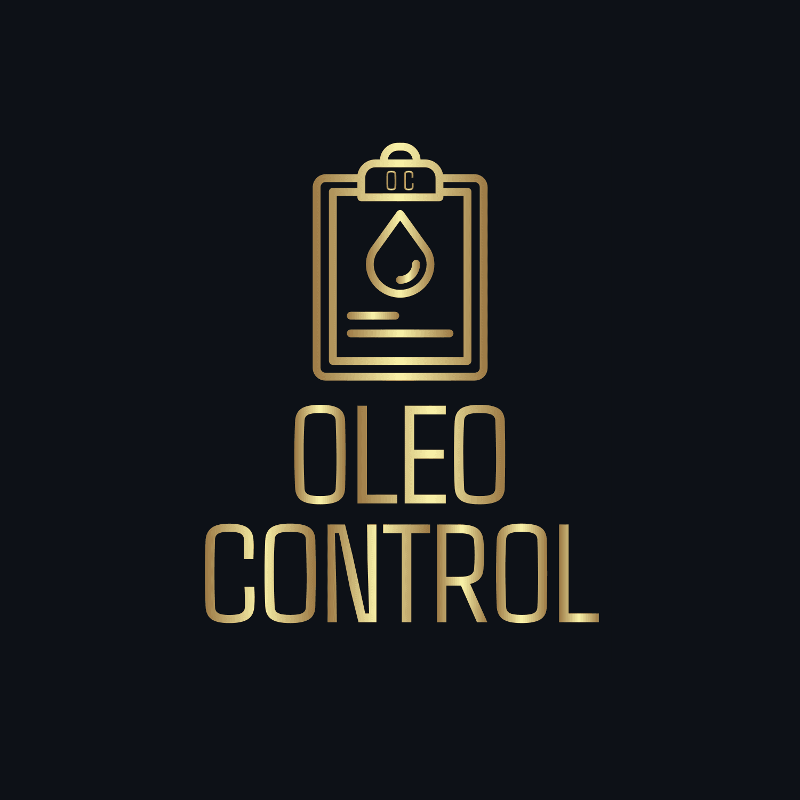

<p align="center">
  
</p>

# Frontend en React para OleoControl

Este es el frontend del proyecto **OleoControl**, una aplicación web desarrollada en React que consume una API RESTful proporcionada por Laravel 11.  
Permite a los usuarios interactuar con el sistema de gestión de almazaras, consultar el historial de entregas de aceituna, visualizar resultados de análisis, generar informes, solicitar liquidaciones y más.

## 🔧 Tecnologías utilizadas

- **React**: Librería JavaScript para construir la interfaz de usuario.
- **Axios**: Cliente HTTP para conectar con la API de Laravel.
- **TailwindCSS**: Framework CSS para un diseño moderno y responsivo.
- **React Router DOM**: Para el manejo de rutas en el frontend.
- **Vite**: Herramienta de construcción rápida y ligera.
- **Context API**: Para la gestión de estados globales.
- **React Hook Form**: Para formularios y validación.
- **Chart.js y Recharts**: Para la visualización de gráficos estadísticos.

## 📋 Requisitos

- **Node.js >= 16.0**
- **NPM o Yarn**

## 🛠️ Instalación

1. Clonar el repositorio:

```bash
git clone https://github.com/tu-usuario/oleocontrol-frontend.git
cd oleocontrol-frontend
```

2. Instalar las dependencias:

```bash
npm install
# o
yarn install
```

3. Configurar las variables de entorno:

Crea un archivo `.env` en la raíz del proyecto con el siguiente contenido:

```env
VITE_API_BASE_URL=http://localhost:8000/api
```

Asegurarse de que la URL base coincida con la del backend en Laravel.

4. Iniciar el servidor de desarrollo:

```bash
npm run dev
# o
yarn dev
```

Esto abrirá la aplicación en `http://localhost:5173` (o el puerto asignado por Vite).

## 🖥️ Scripts disponibles

- `npm run dev`: Inicia el servidor de desarrollo.
- `npm run build`: Compila el proyecto para producción.
- `npm run preview`: Previsualiza el proyecto compilado.
- `npm run lint`: Ejecuta el linter para revisar errores de estilo/código.

## 📂 Estructura del proyecto

```text
oleocontrol-frontend/
├── public/                  # Archivos estáticos públicos (logo, favicon, etc.)
├── src/
│   ├── assets/              # Imágenes y recursos gráficos
│   ├── components/          # Componentes reutilizables
│   ├── config/              # Configuración de la conexión Axios con el back-end
│   ├── hooks/               # Hooks personalizados
│   ├── pages/               # Páginas principales del sitio (Dashboard, Login, etc.)
│   ├── services/            # Módulos para conectar con la API (axios)
│   ├── store/               # Estado global (Context o Zustand)
│   ├── styles/              # Estilos globales o específicos
│   ├── utils/               # Funciones utilitarias
│   ├── routes/              # Definición de rutas (React Router)
│   ├── App.jsx              # Componente raíz de la app
│   └── main.jsx             # Punto de entrada
├── .env                     # Variables de entorno
├── index.html               # HTML base
├── package.json             # Dependencias y scripts
└── vite.config.js           # Configuración de Vite
```

## 🔐 Autenticación y roles

El sistema utiliza **Laravel Sanctum** como mecanismo de autenticación vía tokens.  
Al iniciar sesión, el frontend guarda el token y lo envía en cada petición protegida.

Roles del sistema:

- **Agricultor (socio)**: Consulta de entregas, análisis, solicitudes de liquidación.
- **empleado**: Registro de entregas de aceituna, análisis, liquidaciones.
- **Administrador**: Gestión global del sistema.

## 🚀 Funcionalidades principales

- **Login y logout** con manejo de sesiones.
- **Dashboard personalizado** según el rol del usuario.
- **Historial de entregas**, con detalles y acceso a análisis.
- **Gestión de liquidaciones** por parte del agricultor.
- **Visualización de informes** con gráficos estadísticos.
- **Notificaciones en tiempo real** (visual o futura integración con WebSockets).

## 💳 Créditos

Proyecto desarrollado como parte del ciclo formativo de Desarrollo de Aplicaciones Web (DAW).  
---

© 2025 OleoControl. Todos los derechos reservados.

## ✍️ Autores

Este proyecto fue desarrollado por:

- [@BiLLY-1983](https://www.github.com/BiLLY-1983)

